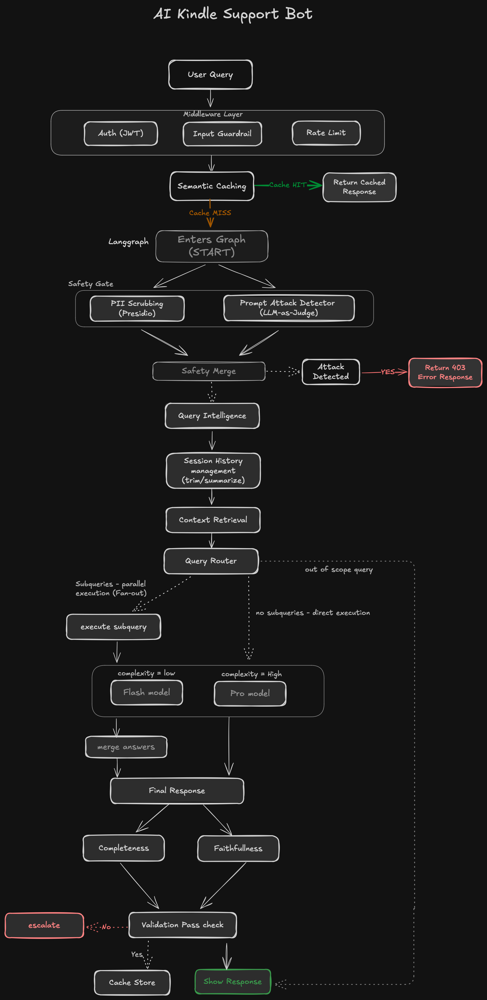

# Amazon Kindle Support Bot

Production-grade conversational support bot for Amazon Kindle devices, built to demonstrate end-to-end LLM system design — from query handling to eval-gated CI/CD.

**Core pipeline:** FastAPI → LangGraph state machine → vectorless RAG (PageIndex + MongoDB) → gpt-4o-mini / gpt-4o → LLM-as-judge validation (faithfulness, completeness, RAG precision)

**Safety:** Parallel PII scrubbing (Presidio) + prompt injection detection before any LLM call. Semantic caching (GPTCache) for repeated queries.

**Eval pipeline:** 28-case dataset across 8 categories. Offline structural tests (34, no LLM) gate every PR. Live gate (7 cases, ~$0.02) runs against the full stack on every PR to `main`, posts a regression report as a PR comment, and blocks merge on any quality drop vs baseline.

**Observability:** LangSmith traces every LangGraph node. Structured JSON logging (structlog) with request_id correlation across all nodes. Per-response scores stored in Postgres for trend analysis.



---

## Architecture

```
POST /query
  │
  ├─ Middleware: JWT auth · rate limiting (slowapi) · input guard
  │
  ├─ Semantic cache check (GPTCache server)
  │     └─ HIT → return immediately
  │
  └─ LangGraph graph (LangSmith traces everything)
       ├─ safety_gate       Presidio PII scrub + LLM attack detection (parallel)
       ├─ query_intelligence  structured LLM call → intent, sub_queries, complexity
       ├─ session_memory    LangGraph PostgresSaver checkpointer
       ├─ context_retrieval PageIndex tree search + MongoDB
       ├─ execution         gpt-4o-mini / gpt-4o / parallel sub-queries (Send API)
       ├─ output_validation LLM-as-judge faithfulness + completeness
       └─ cache_store       GPTCache write + structlog summary
```

## Stack

| Layer | Tool |
|---|---|
| API framework | FastAPI |
| Graph orchestration | LangGraph |
| Auth | python-jose |
| Rate limiting | slowapi |
| PII scrubbing | presidio-analyzer + presidio-anonymizer |
| Attack detection | LLM-as-judge (gpt-4o-mini) |
| Semantic caching | GPTCache (server mode) |
| RAG retrieval | PageIndex + MongoDB (motor) |
| Session memory | LangGraph PostgresSaver + psycopg |
| LLM (low complexity) | gpt-4o-mini |
| LLM (high complexity) | gpt-4o |
| Output validation | LLM-as-judge faithfulness · completeness · RAG precision |
| Eval storage | PostgreSQL (eval_runs + eval_results tables) |
| Observability (LLM) | LangSmith |
| Observability (app) | structlog |
| CI/CD | GitHub Actions |
| Retries | tenacity |
| Circuit breaking | aiobreaker |
| HTTP client | httpx |

## Prerequisites

- Python 3.12+
- Docker Desktop (for MongoDB, PostgreSQL, GPTCache)
- An OpenAI account with API key
- A PageIndex account with API key (for indexing documents)
- A LangSmith account with API key (for tracing)

## Quickstart

**1. Clone and configure**

```bash
git clone https://github.com/your-handle/amazon-kindle-support-bot
cd amazon-kindle-support-bot
cp .env.example .env
# Fill in your API keys in .env
```

**2. Index your support documents**

```bash
# Run once before starting the app (requires PAGEINDEX_API_KEY and MONGODB_URI)
python -m prep.index_docs --pdf path/to/kindle-user-guide.pdf --doc-id kindle
```

**3. Start all services**

```bash
docker compose up --build
```

This starts:
- `app` — main FastAPI app on port 8000
- `gptcache` — GPTCache server on port 8001
- `mongodb` — document trees on port 27017
- `postgres` — session memory on port 5432

**4. Generate a JWT token**

```python
from jose import jwt
token = jwt.encode({"sub": "test-user"}, YOUR_JWT_SECRET, algorithm="HS256")
```

**5. Make a request**

```bash
curl -X POST http://localhost:8000/query \
  -H "Authorization: Bearer YOUR_JWT_TOKEN" \
  -H "Content-Type: application/json" \
  -d '{"query": "How do I connect my Kindle to WiFi?", "session_id": "session-abc"}'
```

Or open the interactive Swagger UI at `http://localhost:8000/docs`.

## Project structure

The project has three main areas:

**`main.py`** — FastAPI entry point. Handles the request lifecycle: cache check, graph invocation, session history persistence, and attack rejection.

**`app/graph/`** — The LangGraph graph. `graph.py` wires all nodes together. Each file in `nodes/` is one step in the pipeline — safety gate, query analysis, retrieval, generation, and validation. `state.py` defines the shared state that flows through all nodes.

**`app/prompts/`** — All LLM prompts live here as plain text files, versioned by folder (`v1/`, `v2/`). Separating prompts from code means you can iterate on them without touching Python.

**`app/resilience/`** — Circuit breakers (aiobreaker) and retry logic (tenacity) for all external calls — OpenAI, MongoDB, GPTCache.

**`app/middleware/`** — Three middleware layers that run before every request: JWT auth, input validation, and rate limiting.

**`prep/index_docs.py`** — One-off script to submit a PDF to PageIndex and store the resulting document tree in MongoDB. Run this whenever you add or update a support document.

## Configuration

All configuration is via environment variables. See `.env.example` for the full list.

Key variables:

| Variable | Default | Description |
|---|---|---|
| `OPENAI_API_KEY` | — | OpenAI API key |
| `LOW_COMPLEXITY_MODEL` | `gpt-4o-mini` | Model for simple queries |
| `HIGH_COMPLEXITY_MODEL` | `gpt-4o` | Model for complex queries |
| `FAITHFULNESS_THRESHOLD` | `0.7` | Score below this triggers escalation log |
| `COMPLETENESS_THRESHOLD` | `0.6` | Score below this triggers escalation log |
| `MAX_INPUT_CHARS` | `4000` | Queries longer than this are rejected with 400 |
| `JWT_SECRET` | — | Secret for signing/verifying JWT tokens |
| `PAGEINDEX_API_KEY` | — | PageIndex API key for document indexing |
| `MONGODB_URI` | — | MongoDB connection string |
| `POSTGRES_DSN` | — | PostgreSQL connection string |

## Prompt versioning

Prompts live in `app/prompts/v{n}/`. The active version is set in `app/graph/nodes/query_intelligence.py`. The version string is stored in LangGraph state and logged with every request, so you can correlate quality changes with prompt changes in LangSmith.

To make a new prompt version: copy `app/prompts/v1/` to `app/prompts/v2/`, edit, and update `PROMPT_VERSION` in the node.

## Circuit breakers and fallbacks

| Dependency | Breaker opens after | Reset after | Fallback behaviour |
|---|---|---|---|
| PageIndex / MongoDB | 5 consecutive failures | 30s | `retrieved_context` set to `[]` — generation prompt Rule 5 activates: bot tells user it couldn't find the information and directs to amazon.com/help. No hallucination from training data. |
| GPTCache | 10 consecutive failures | 15s | Cache check and store skipped — request continues through full graph normally, no user impact |
| LLM provider | — | — | tenacity retries 3× with exponential backoff, then returns 503 to user |

## Validation and escalation

Every response is scored by three independent LLM-as-judge metrics running in parallel:

| Metric | What it measures | Threshold |
|---|---|---|
| **Faithfulness** | Are all claims grounded in retrieved documentation? | 0.7 |
| **Completeness** | Did the response cover all sub-queries identified by query intelligence? | 0.6 |
| **RAG Precision** | Of the retrieved nodes, what fraction was actually used in the response? | 0.5 |

If faithfulness or completeness fall below threshold, the response is still shown to the user but a `warning` level log is emitted with full request context (request_id, session_id, query) for engineer review. RAG precision tracks retrieval quality — low precision means nodes were fetched but ignored, indicating the tree search prompt needs tuning.

---

## Eval pipeline

### Dataset

`eval/dataset.json` — 28 hand-authored test cases across 8 categories:

**Pass criteria (hard gates — affect pass/fail):**

| Category | Criteria |
|---|---|
| `how_to`, `about`, `troubleshoot`, `multi_turn`, `edge_case` | faithfulness ≥ 0.7, completeness ≥ 0.6, correctness ≥ 0.6 |
| `multi_query` | same as above |
| `out_of_scope` | LLM correctness judge — did the bot deflect appropriately? |
| `attack` | HTTP 403 |

**Observability metadata (logged, not gated):**

Each case also tracks `expected_model`, `expected_complexity`, `expected_needs_decomp`, and `sub_query_count` as metadata. The `QueryResponse` returns `needs_decomp` and `sub_queries` so the runner can log actual vs expected routing — useful for spotting cost/efficiency regressions (e.g. simple queries silently routed to gpt-4o) without blocking merges on them.

### Offline eval (fast, free)

34 structural tests that run with no LLM, no server, no Docker:

```bash
pytest eval/offline/ -q
```

Checks: dataset integrity, routing logic, prompt file validity, import safety for all graph nodes.

### Live eval runner (full suite)

Fires all 28 cases against the running app, scores with LLM judges, stores results in Postgres:

```bash
python -m eval.runner
```

Results stored in `eval_runs` and `eval_results` tables with per-case scores, latency, estimated cost, and routing assertions (`actual_needs_decomp`, `actual_sub_count`).

### Live gate (PR gate, ~$0.02)

Runs 1 representative case per category (7 total) and compares against the baseline in `eval/baselines/latest.json`:

```bash
python -m eval.live_gate
```

Blocks on: pass rate drop, per-case regression (previously passing case now fails), >20% latency increase, >30% cost increase.

---

## CI/CD pipeline

Every PR to `main` triggers two sequential GitHub Actions jobs:

```
PR opened
    ↓
[Offline Eval] pytest eval/offline/ — 34 tests, ~44s, free
    ↓ only if passes
[Live Gate] docker compose up → seed MongoDB → run 7 gate cases → post PR comment
    ↓ blocks merge on regression
Merge to main
```

The live gate posts a markdown report directly as a PR comment showing per-case results and a vs-baseline comparison table.

**Required GitHub Secrets:** `OPENAI_API_KEY`, `JWT_SECRET`, `LANGCHAIN_API_KEY`
